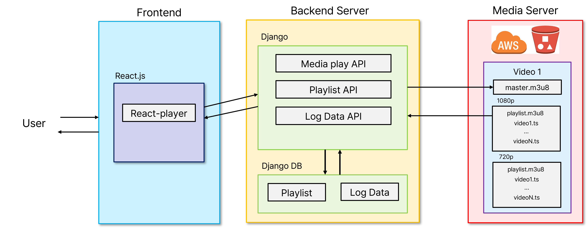

# OTT 앱과 유사한 간단한 미디어 웹 앱 개발 설계 문서

## 1. 문서 설명

### 1.1 목적 (Purpose)

본 문서의 목적은 OTT 앱과 유사한 미디어 컨텐츠 재생과 이를 사용하면서 발생하는 데이터를 서버로 전송하는 간단한 웹 앱 서비스에 대한 요구사항을 기술하는 것이다.

### 1.2 범위 (Scope)

본 문서에는 다음의 요구 사항이 포함되어 있다.  

* 서버에 저장되어 있는 미디어 컨텐츠를 클라이언트에서 재생한다.
* 미디어 재생 과정에서 사용자의 비트레이트(Bitrate)가 변한다면, 그에 맞는 미디어 컨텐츠를 재생한다.
* 미디어 재생 과정에서 사용자의 로그 및 미디어 데이터를 추출하고 DB에 저장한다.

### 1.3 용어 및 약어 정리 (Definitions and Abbreviations)

* Bitrate: 동영상에서 비트레이트는 1초의 영상을 구성하는 데이터의 크기를 의미하며, 비트레이트가 높을수록 동영상의 화질은 좋지만 그와 동시에 동영상의 크기도 커진다.
* API(Application Programming Interface): 프로그래밍에서 프로그램을 작성하기 위한 일련의 부(sub) 프로그램을 의미하며 프로토콜 등을 정의하여 상호 작용하기 위한 인터페이스 사양을 의미한다.
(사용한 기술 스택들의 용어도 정리?)
* Amazon S3: 아마존 웹 서비스에서 제공하는 온라인 스토리지 웹 서비스이다.

## 2. 시스템 컨택스트 (System Context)

우리 팀의 미디어 웹 앱은 일반 OTT 앱과 유사하게 사용자에게 특정 미디어 컨텐츠를 입력 받으면 사용자의 환경에 맞게 미디어 컨텐츠를 재생하는 Frontend 서버와 해당 미디어 데이터를 Amazon S3 서버에서 불러와 전송해주는 Backend 서버로 분리하여 구현되었다. 

  

## 3. 요구사항 (Requirements)

### 3.1 기능 요구사항 (Functional Requirements)

### Backend Server

#### 3.1.1. 데이터베이스의 데이터 요청에 대한 처리

ID  | Requirement   | API ID 
--- |   ---     |   ---
FR01-1  |   frontend 서버로부터 존재하는 VOD 컨텐츠 목록 데이터에 대한 요청을 받으면, backend 서버는 데이터베이스에서 미디어 목록 정보를 frontend 서버로 전송한다. 자세한 동작 과정은 다음과 같다.  <ol><li>request를 받으면 'vod' 타입의 비디오 목록을 DB로부터 받아서 VideoSerializer 객체를 생성한다.</li><li>VideoSerializer 에서 6개 까지의 vod 정보를 가져와서 JSON 형식으로 return한다.</li></ol>  | BA01-1  
FR01-2  |   frontend 서버로부터 존재하는 라이브 컨텐츠 목록 데이터에 대한 요청을 받으면, backend 서버는 데이터베이스에서 미디어 목록 정보를 frontend 서버로 전송한다. 자세한 동작 과정은 다음과 같다.  <ol><li>request를 받으면 'live' 타입의 비디오 목록을 DB로부터 받아서 VideoSerializer 객체를 생성한다.</li><li>VideoSerializer 에서 2개 까지의 live 컨텐츠 정보를 가져와서 JSON 형식으로 return한다.</li></ol> | BA02-1   

#### 3.1.2. Client로부터 입력 받을 interface 제공

ID  | Requirement   |   API ID 
--- |   ---     |   --- 
FR02-1  |   client로부터 데이터를 전송 받으면, backend 서버는 데이터베이스의 필드에 맞게 파싱한다. - 데이터베이스의 필드에는 다음 요소들이 포함되어야 한다 <ul> <li>user_id: 사용자의 ID</li><li>video_id: 사용자가 재생한 컨텐츠의 ID</li><li>bandwidth: 제공되는 bitrate 정보</li><li>time: 사용자가 컨텐츠의 재생을 시작한 시각</li></ul>   자세한 동작 과정은 다음과 같다.  <ol><li>backend 서버는 frontend 서버가 전송한 Data로부터 user_id, video_id, time을 가져와 History table의 row로 저장한다.</li></ol>|  BA03-1  | 
FR02-2  |  Client가 데이터 시각화에 필요한 데이터를 요청하면, backend 서버는 데이터베이스에서 정보를 불러와 Client로 전송한다. 자세한 동작 과정은 다음과 같다.  <ol><li>History, User 테이블에서 user_id = id 인 row를 DB로부터 가져와 HistorySerializer, UserSerializer 객체를 생성한다.</li><li>History row 의 video_id와 일치하는 Video 테이블의 row로 VideoSerializer를 생성한다.</li><li>HistorySerializer, VideoSerializer 로부터 time, title, username 그리고 tag를 파싱하고, time으로 history_list를 구성하여 user_data 딕셔너리를 만들어 반환한다.</li></ol>  |   BA04-1  | 

### Frontend Server

#### 3.1.3. 미디어 목록 조회
ID  | Requirement
--- |   --- 
FR03-1-1  |   사용자로부터 미디어 목록 요청을 받으면, frontend 서버는 backend 서버로 미디어 목록 데이터를 요청한다.
FR03-1-2  |   backend 서버로부터 미디어 목록 데이터를 응답 받으면, frontend 서버는 화면에 미디어 목록을 출력한다.  
----

#### 3.1.5. 미디어 재생
ID  | Requirement 
--- |   ---
FR04-1-1  |   사용자로부터 미디어 재생 요청을 받으면, frontend 서버는 미디어 데이터를 요청한다.
----

#### 3.1.6. 사용자의 특정 배속 요청 처리
ID  | Requirement 
--- |   --- 
FR05-1-1  |   사용자로부터 배속 재생을 요청 받으면, frontend 서버는 해당 미디어를 사용자가 원하는 배속으로 재생한다. 
----

#### 3.1.7. 사용자의 특정 해상도 요청 처리
ID  | Requirement 
--- |   --- 
FR05-1-2  |   사용자로부터 특정 해상도의 미디어를 요청 받으면, frontend 서버는 해당 해상도의 미디어 데이터를 요청한다.  
----

#### 3.1.8. 동영상 시청 기록 및 품질 데이터를 이용한 시각화
ID  | Requirement
--- |   --- 
FR06-1-1  |   사용자로부터 미디어 재생 요청을 받으면, frontend 서버는 여러 데이터를 backend 서버로 전송한다.  
FR06-1-2  |   사용자로부터 데이터 시각화 요청을 받으면, frontend 서버는 backend 서버로 시각화에 필요한 데이터를 요청한다. 
FR06-1-3  |   backend 서버로부터 시각화에 필요한 데이터를 응답 받으면, frontend 서버는 해당 데이터를 시각화하여 출력한다. 
----

## 4. Database Design
### History, User, Video 모델을 사용하였다

### 1. Video
video_id | title | description | master | tags | streaming_type
--- | --- | --- | --- | --- | ---
video의 ID(Interger) | video의 제목(String) | video 설명(String) | master m3u8 링크(String) | video hash tags(String) | "live"/"vod"(String)

### 2. History
user_id | video_id | time
--- | --- | ---
user의 id(Integer) | video의 id(Integer) | video 재생 시의 datetime(string)

### 3. User
name | user_id | age | sex
--- | --- | ---
user의 이름(String) | user의 id(Integer) | user의 나이(String) | user의 성별(String)
  
  
## 5. Architecture/Design Decisions

### Frontend
  - 현재 가장 활발하게 사용되고 있는 자바스크립트 프레임워크인 React를 사용.
  
### Backend
  - 비교적 쉬운 언어인 파이썬을 사용하여 백엔드와 DB를 모두 쉽게 관리할 수 있는 Django 프레임워크를 선택.
  - Django는 엄밀히 말하면 웹서버가 아니고 웹서버 프레임워크이기에 Django를 이용하여 실제 웹서버를 구축하기 위해서는 추가적인 작업들이 필요.
  - 본 프로젝트에서는 Django 서버 코드를 AWS EC2에서 구동하여 백엔드 서버로서 사용.
  - NoSQL로 관리가 편리하고 간단한 DB를 구성하기에 적합한 MongoDB를 데이터베이스로 선택.
  - NoSQL 특성상 데이터베이스에서 처리할 수 있는 기능들이 한정적인 단점이 존재.
  - m3u8, ts의 미디어 컨텐츠를 저장할 서버로는 AWS S3를 선택.
  - 비용을 지불해야하는 단점이 있지만, 쉽게 미디어 컨텐츠를 저장할 수 있고 AWS Cloudfront를 이용하여 호스팅도 가능하기에 실제 OTT의 미디어 서버와 유사하게 만들기 위하여 이와 같은 결정을 함.
  
----

